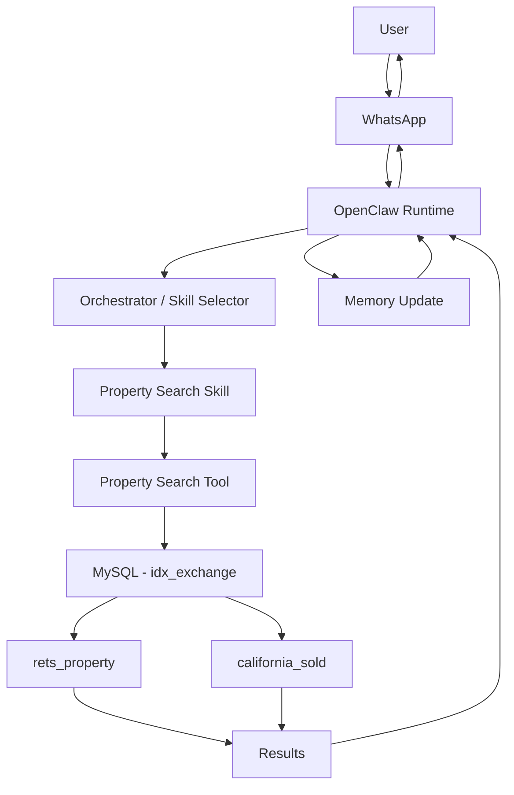

Overview : 

OpenClaw is the orchestration runtime for the IDX Exchange AI assistant. It manages communication channels, routes user requests to appropriate skills, executes tools, maintains session state, and manages memory.

Architecture Components : 

Channels : 
WhatsApp, email, and web provide interfaces through which users communicate with the assistant.

OpenClaw Runtime : 
Receives incoming messages and coordinates the processing of requests.

Orchestrator/Skill Selector : 
Determines which skill or agent should handle a user's request.

Skills :
Modular capabilities that perform specific types of tasks, such as property search, market statistics, or RAG-based knowledge retrieval.

Tools : 
Typed functions that perform actions for a skill, such as querying the MLS database.

Sessions : 
Maintain the state of an individual user's conversation so follow-up messages can be understood in context.

Memory :
Stores information used by the assistant. Session memory handles short-term conversational context, while long-term vector storage can be used for retrieving previously stored information.

MLS Databases :
Contains rets_property (active MLS listings) and california_sold (sold property transactions)

## Architecture Workflow

